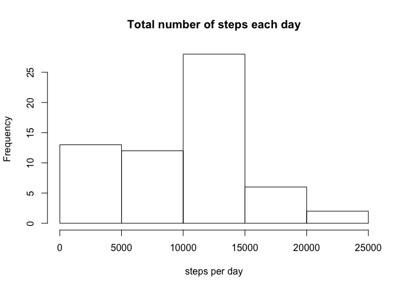
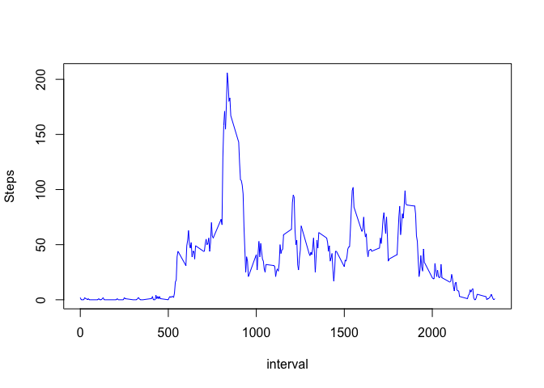
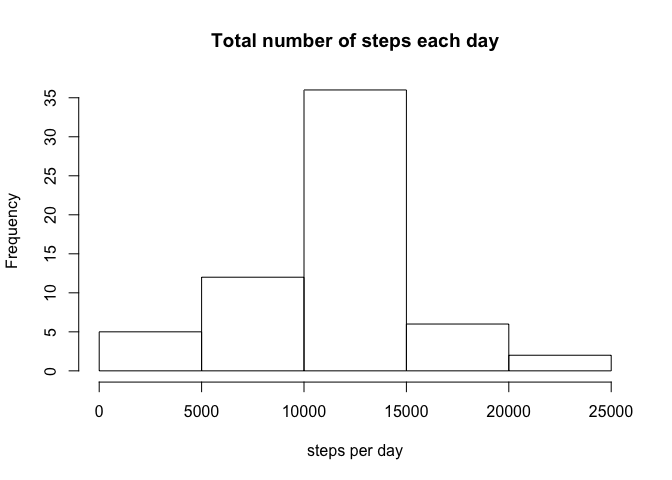
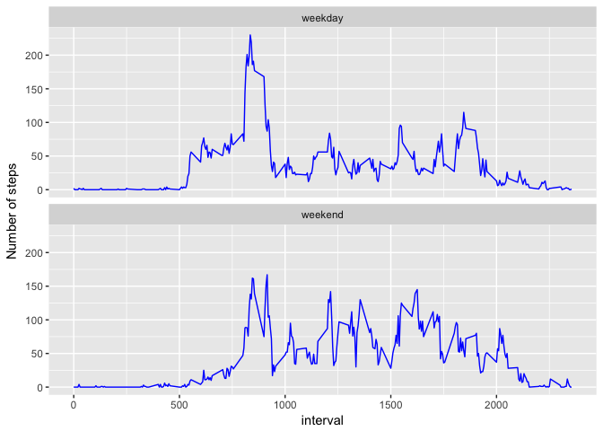

## Loading the data

```r
activity <- read.csv("activity.csv",header = TRUE,sep = ",")
```
## What is mean total number of steps taken per day?
1. From the raw data (data with NAs) calculate the total number of steps taken each day

```r
steps.per.day.withNA <- with(activity,tapply(steps,date,sum,na.rm=T))
steps.per.day.withNA.df <- 
        data.frame(date=names(steps.per.day.withNA),steps=steps.per.day.withNA)
```
2. Histogram of the total number of steps taken each day

```r
hist(steps.per.day.withNA.df$steps,main = "Total number of steps each day",xlab = "steps per day")
```

<!-- -->

3. Mean total number of steps taken per day is `mean(steps.per.day.withNA.df$steps)` = 9354.23
4. Median of total number of steps taken per day is `median(steps.per.day.withNA.df$steps)` = 10395

## What is the average daily activity pattern?
1. Calculate the average steps per 5 min interval

```r
avg.steps.per.int <- with(activity,tapply(steps,interval,mean,na.rm=T))
avg.steps.per.int.df <- data.frame(interval=names(avg.steps.per.int),avg_steps=avg.steps.per.int)
avg.steps.per.int.df$interval <- as.character(avg.steps.per.int.df$interval)
avg.steps.per.int.df$avg_steps <- round(avg.steps.per.int.df$avg_steps)
```
2. Time series plot of the 5-minute interval and the average number of steps taken, averaged across all days (y-axis)

```r
plot(avg.steps.per.int.df$interval,avg.steps.per.int.df$avg_steps,
     ylab="Steps",xlab="interval",type="l",col="blue")
```

<!-- -->

3. The 5-minute interval, on average across all the days in the dataset, which contains the maximum number of steps is `avg.steps.per.int.df[which.max(avg.steps.per.int.df$avg_steps),1]` = 835

## Imputing missing values
1. Total number of missing values in the dataset (i.e. the total number of rows with NAs) is `sum(is.na(activity$steps))` = 2304

### Strategy for filling in missing values
1. First get the mean steps per interval

```r
mean.activity.per.interval <- with(activity,tapply(steps,interval,mean,na.rm=T))
```
2. Turn it into a dataframe

```r
mean.activity.per.interval.df <- data.frame(interval=names(mean.activity.per.interval),
                                            mean_steps=mean.activity.per.interval)
```
3. Create two separate data frame of NAs and without NAs

```r
activity_NA <- activity[which(is.na(activity$steps)),]
activity_noNA <- activity[which(!is.na(activity$steps)),]
```
4. Merge the data frames `activity_NA` and `mean.activity.per.interval.df`

```r
activity_NA_removed <- merge(activity_NA,mean.activity.per.interval.df,by = "interval")
```
5. Round off the mean_steps column

```r
activity_NA_removed$mean_steps <- round(activity_NA_removed$mean_steps)
```
6. Keep the required columns only

```r
activity_NA_removed <- subset(activity_NA_removed,select = c(4,3,1))
```
7. Rename the 1st column of the data frame `activity_NA_removed`

```r
colnames(activity_NA_removed)[1] <- "steps"
```
8. Collect all the records together again in a new processed data frame

```r
activity.processed <- rbind(activity_NA_removed,activity_noNA)
```

### From the imputed data (data without NAs) `activity.processed` calculate the total number of steps per day

```r
steps.per.day.withoutNA <- with(activity.processed,tapply(steps,date,sum,na.rm=T))
steps.per.day.withoutNA.df <- 
        data.frame(date=names(steps.per.day.withoutNA),steps=steps.per.day.withoutNA)
```
1. Mean total number of steps taken per day is `mean(steps.per.day.withoutNA.df$steps)` = 10765.64
2. Median of total number of steps taken per day is `median(steps.per.day.withoutNA.df$steps)` = 10762
3. Histogram of the total number of steps taken each day

```r
hist(steps.per.day.withoutNA.df$steps,main = "Total number of steps each day",xlab = "steps per day")
```

<!-- -->

## Are there differences in activity patterns between weekdays and weekends?
1. First get the new variable indicating whether the date is weekend or weekday

```r
activity.processed$date <- as.Date(activity.processed$date)
activity.processed$dayType <- ifelse(weekdays(activity.processed$date) 
                                     %in% c("Sunday","Saturday"),"weekend","weekday")
```
2. Convert the variable into a factor

```r
activity.processed$dayType <- as.factor(activity.processed$dayType)
```
3. Order the data set by date

```r
activity.processed <- activity.processed[order(activity.processed$date),]
```
4. Make a panel plot containing a time series plot of the 5-minute interval and the average number of steps taken, averaged across all weekday days or weekend days 
5. First prepare the weekend dataset

```r
avg.steps.per.int.we <- with(subset(activity.processed,dayType == "weekend")
                             ,tapply(steps,interval,mean,na.rm=T))
avg.steps.per.int.we.df <- data.frame(interval=names(avg.steps.per.int.we),
                                      avg_steps=avg.steps.per.int.we)

avg.steps.per.int.we.df$interval <- 
        as.character.numeric_version(avg.steps.per.int.we.df$interval)
avg.steps.per.int.we.df$interval <- as.numeric(avg.steps.per.int.we.df$interval)

avg.steps.per.int.we.df <- cbind(avg.steps.per.int.we.df,
                                 rep("weekend",dim(avg.steps.per.int.we.df)[1]))
colnames(avg.steps.per.int.we.df)[3] <- "dayType"
```
6. Second, prepare the weekday dataset

```r
avg.steps.per.int.wd <- with(subset(activity.processed,dayType == "weekday")
                             ,tapply(steps,interval,mean,na.rm=T))
avg.steps.per.int.wd.df <- data.frame(interval=names(avg.steps.per.int.wd),
                                      avg_steps=avg.steps.per.int.wd)

avg.steps.per.int.wd.df$interval <-
        as.character.numeric_version(avg.steps.per.int.wd.df$interval)
avg.steps.per.int.wd.df$interval <- as.numeric(avg.steps.per.int.wd.df$interval)

avg.steps.per.int.wd.df <- cbind(avg.steps.per.int.wd.df,
                                 rep("weekday",dim(avg.steps.per.int.wd.df)[1]))
colnames(avg.steps.per.int.wd.df)[3] <- "dayType"
```
7. Get the two datasets together

```r
avg.steps.per.int.WeWd <- rbind(avg.steps.per.int.wd.df,avg.steps.per.int.we.df)
avg.steps.per.int.WeWd$avg_steps <- round(avg.steps.per.int.WeWd$avg_steps)
colnames(avg.steps.per.int.WeWd)[2] <- "steps"
```
8. Plot the data

```r
require(ggplot2)
ggplot(avg.steps.per.int.WeWd, aes(interval,steps)) + 
        geom_line(colour = "blue") + 
        facet_wrap(~dayType,ncol = 1) +
        labs(y="Number of steps")
```

<!-- -->
